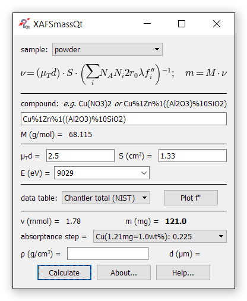

About XAFSmass
--------------

  

XAFSmass is a program for calculating the mass of XAFS [X-Ray Absorption Fine Structure] samples.
The chemical formula parser understands parentheses and weight percentage, also in nested form.
XAFSmass reports the quantity (weight, thickness or pressure) together with the expected height
of the absorption edge. The GUI is provided by Qt.

Created by Konstantin Klementiev and Roman Chernikov under MIT License.

Dependencies
------------

numpy, pyparsing and matplotlib are required. Qt must be provided by either
PyQt4, PyQt5 or PySide.

Installation
------------

Unzip the .zip file into a suitable directory and run ``python XAFSmassQt.py``.
On Windows, run ``pythonw XAFSmassQt.py`` or give it a .pyw extension to
suppress the console window.

You may want to run ``python setup.py install`` in order to put the XAFSmass
package to the standard location.
