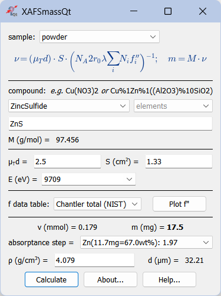

XAFSmass
========

  

XAFSmass is a python program for calculating the mass of XAFS (X-ray Absorption Fine Structure) samples.
The chemical formula parser understands parentheses and weight percentage, also in nested form.
XAFSmass reports the quantity (weight, thickness or pressure) together with the expected height
of the absorption edge. The GUI is provided by Qt.

Copyright (c) 2015 Konstantin Klementiev and Roman Chernikov under the MIT License terms

Dependencies
------------

numpy, matplotlib and pyparsing are required. Qt must be provided by either
PyQt5, PySide2, PyQt6 or PySide6 by means of qtpy.

Running without installation
----------------------------

Unzip the .zip file from GitHub into a suitable directory and run ``python XAFSmassQt.py``.
One advantage of no installation is a single location of XAFSmass served by any Python installation.

Running with installation
-------------------------

From the unzipped directory that has ``pyproject.toml`` run ``python -m pip install .``
or run ``pip install xafsmass`` to get it directly from PyPI.
After installation, XAFSmass can be started by ``xafsmass`` command.

Documentation
-------------

See it on http://xafsmass.readthedocs.io

